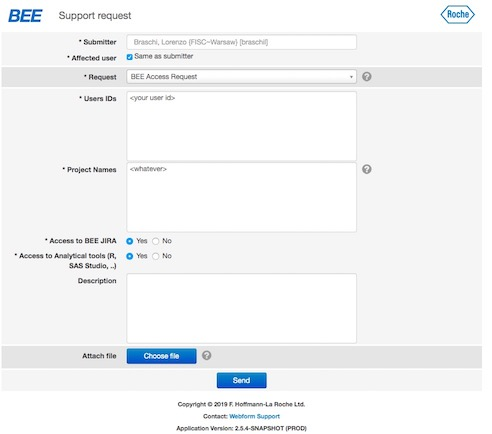
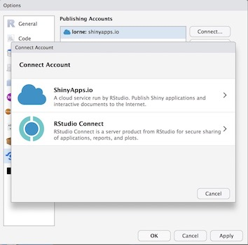
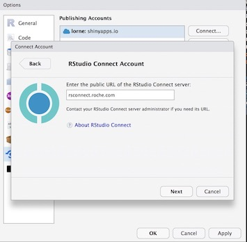
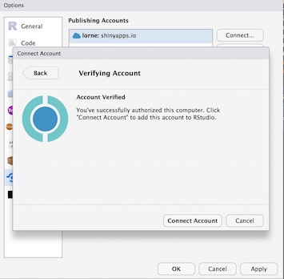

<!-- README.md is generated from README.Rmd. Please edit that file -->

# code4life workshop

This is the repository for the code4life workshop “End to End
development”.

1.  [Requirements](#req1)
2.  [R knowledge](#rknow)

# Requirements

  - A github account (public account - create one at
    <https://github.com/>)
  - R and RStudio
  - A RSConnect account.

## R and RStudio

In this workshop we will use R and RStudio, therefore they need to be
installed in your local machines. You can get R
[here](https://cran.r-project.org/) and RStudio
[here](https://www.rstudio.com/products/rstudio/download/#download).
(Note that you need
***BOTH***).

[](https://www.rstudio.com/products/rstudio/download/#download)

## GitHub account

Every participant should have a GitHub account ready for the workshop.
Setting one up is easy and straightforward. Just go to
[github.com](github.com) and follow the steps.

[](https://github.com/)

## RSConnect

We will deploy our report on Roche RStudio RSConnect. This is a paid
service offered by RStudio for deploying dashboards, documents, plots
and in general anything developed in R. We at Roche have it installed,
so please make sure you have access to it by putting a request on
[webforms.roche.com](webforms.roche.com):

[](https://webforms.roche.com/)

Then fill a request with the following parameters:



and you should get your request granted within 24h.

Once you have been granted access (you should get an email) you should
validate your account on the server. Log in to
[rsconnect.roche.com](rsconnect.roche.com) and follow the steps.

You’ll also need need to configure your RStudio Desktop to be able to
connect to RStudio RSConnect. On the menu Options, click on Global
Options


and then Publishing. Your Publishing Accounts should be empty (mine has
a couple of shinyapps.io connections).


Click “Connect” and a menu will pop up with the options:



Choose rsconnect and introduce the name of the server:
`rsconnect.roche.com`:



This will bring forth another window which will ask for your Roche
access (it’s Roche owned)


If you have entered your connections correctly and your account is
validated by BEE, you should get a validation screen:



Click on “Connect Account” and you can check that you have now
`rsconnect.roche.com` as a valid connection:


## Shinyapps.io

As an alternative, or in case it is delayed, you can get your
documentation published on [Shinyapps.io](https://www.shinyapps.io/)

[](https://www.shinyapps.io/)

# R knowledge

## Pipes

In this workshop we will make heavy use of the tools of the
[`tidyverse`](https://www.tidyverse.org/), a suite of packages for
expanding R’s capabilities beyond the base language. In particular, we
will make use of `dplyr` verbs such as `select()`, `filter()`, and so
on.

Also it will heavily feature the pipe operator from `magrittr`, `%>%`,
which enables to chain operations in a pipe:

``` r
# Classic format: 
yada <- read.csv("some_data.csv")   # Read a file
yada <- select(yada, 1:4)           # Select the first four columns

# Pipe
yada <- read.csv("some_data.csv") %>%   # Read a file 
  select(1:4)                           # Select the first four columns
```

If you are not familiar with the `%>%` operator, consider having a read:
[Introduction to
`magrittr`](https://cran.r-project.org/web/packages/magrittr/vignettes/magrittr.html)

## Functional programming tools

We will also make use of functional programming tools that are enhanced
by the [`purrr`](https://purrr.tidyverse.org/) package. Essentially,
this is an improved version of the `*apply` family of functions
(`apply`, `sapply`, `lapply`, and so on) for passing functions as
arguments to lists (including dataframes).

A canonical example of this functionality is as follows:

``` r
mtcars %>%
  split(.$cyl) %>% # from base R
  map(~ lm(mpg ~ wt, data = .)) %>%
  map(summary) %>%
  map_dbl("r.squared")
#>         4         6         8 
#> 0.5086326 0.4645102 0.4229655
```

In particular, we will be using these functions in conjunction with
`dplyr::mutate()` statements to apply modelling functions to nested
list-columns in dataframes:

``` r
by_country <- by_country %>% 
  mutate(model = map(data, country_model))
by_country
#> # A tibble: 142 x 4
#>   country     continent data              model   
#>   <fct>       <fct>     <list>            <list>  
#> 1 Afghanistan Asia      <tibble [12 × 4]> <S3: lm>
#> 2 Albania     Europe    <tibble [12 × 4]> <S3: lm>
#> 3 Algeria     Africa    <tibble [12 × 4]> <S3: lm>
#> 4 Angola      Africa    <tibble [12 × 4]> <S3: lm>
#> 5 Argentina   Americas  <tibble [12 × 4]> <S3: lm>
#> 6 Australia   Oceania   <tibble [12 × 4]> <S3: lm>
#> # … with 136 more rows
```

For more information on this, check out the [R for Data Science
book](https://r4ds.had.co.nz/), in particular the chapter on [Many
Models](https://r4ds.had.co.nz/many-models.html#creating-list-columns).
